# DockDesk v3.0.1

**Local-First Semantic Documentation Auditor**

Ensure your code and documentation never drift apart without sending a single byte to the cloud.

[](https://pypi.org/project/dockdesk/)
[](https://pypi.org/project/dockdesk/)
[](https://github.com/srivatsa-source/dockdesk)
[](LICENSE)
[](https://ollama.com)

---

## Table of Contents

- [Overview](#overview)
- [What's New in v3.0.0](#whats-new-in-v300)
- [Architecture](#architecture)
- [Quick Start](#quick-start)
- [Model Selection](#model-selection)
- [CLI Reference](#cli-reference)
- [GitHub Actions Integration](#github-actions-integration)
- [Dashboard](#dashboard)
- [Configuration](#configuration)
- [Roadmap](#roadmap)
- [Contributing](#contributing)
- [License](#license)

---

## Overview

DockDesk is a semantic auditor that runs entirely on your local machine or CI runner. Instead of checking for typos, it reads your **code logic** and compares it against your **documentation claims**.

If your code uses `os.getenv('API_KEY')` but your README says "Hardcode your key", DockDesk will:

1. Flag the semantic drift
2. Analyze the discrepancy
3. Auto-generate a fix for your documentation

### Problems Solved

| Problem | Solution |
|---------|----------|
| **Privacy Risks** | Runs 100% locally via Ollama. No cloud API calls. |
| **Documentation Rot** | Semantic analysis catches drift that static tools miss. |
| **Infrastructure Cost** | No API credits. Efficient SLMs run on standard hardware. |

---

## What's New in v3.0.0

| Feature | Description |
|---------|-------------|
| Natural-Language CLI | Running `dockdesk` with no args now opens a chat-style command interface for audit, dashboard, and workspace actions |
| Target Picker | Audit prompts now accept either a file or folder target, with folder browsing as a fallback |
| Profiles + Completion | Built-in profile management and shell completion setup via `dockdesk profile` and `dockdesk completion` |
| Launcher Commands | Open the React dashboard, start the Rich TUI, or run the Discord bot from the CLI |
| Model Rotation | `--rotate-models` round-robins local audit-suitable models per file |
| Export Upgrades | Dashboard exports now include quick Excel, CSV, and print-friendly PDF output |

## What's New in v3.0.1

Changelog (patch release):

| Fix | Description |
|------|-------------|
| **CLI: Audit discovery** | Resolved interactive prompt regressions so NLP-specified folder targets run non-interactively when provided (fixes `--auto-tune` NLP workflows). |
| **Runtime: cache & pool initialization** | Fixed NameError crashes by making cache / Ollama pool instantiation defensive and scoped per-run. This prevents cross-run contamination and crashes during audit pipeline execution. |
| **Stability** | Improved error handling during LLM subprocess reads to avoid crashes from unexpected encodings; further decoding hardening is planned. |


## What's New in v2.3

| Feature | Description |
|---------|-------------|
| **📏 Custom Rule Engine** | `--rules` flag injects team-specific audit rules into LLM prompts |
| Benchmark Suite | Golden-set test fixtures with precision/recall/F1 scoring (100% / 71% / 83%) |
| CLI UI Refresh | Cyan-themed banner, color-coded results table, verdict panel (CLEAN/REVIEW/UNSAFE) |
| Force Full Scan | `--force-full-scan` bypasses git/merkle diff to audit ALL files |
| **🐞 Workspace Scoping Fix** | Git diff now correctly scopes to subdirectories |
| SARIF Output | `--format sarif` for IDE integration + GitHub Code Scanning |
| PDF Export | Dashboard "Export PDF" button via print CSS |
| **🌳 AST-Aware RAG** | Language-specific code splitting for 20+ file types |

### Previous (v2.2)

| Feature | Description |
|---------|-------------|
| 7B Default Model | Upgraded from 3B to `qwen2.5-coder:7b` for dramatically better accuracy |
| SKIP Status | Undocumented files are now SKIPped instead of false-FAILed |
| Smarter Pipeline | Rewritten prompts, reasoning overrides, and parse fallbacks eliminate false positives |
| n8n-Style Dashboard | Modern dark-theme dashboard with collapsible sidebar |
| Composite Action | 10x faster GitHub Action — no Docker build (~30s vs ~4min) |
| **Model Freedom** | Choose any Ollama model with LOC-based auto-tuning |
| **One-Click Fixes** | Auto-apply documentation fixes with `--fix` |
| **SARIF Output** | IDE integration for VS Code |
| **Faster Audits** | Git diff scoping, parallel LLM calls, cached RAG |
| **pip install** | `pip install dockdesk` — works on any system, no cloning needed |
| **Git URL Audits** | Audit any repo by URL: `dockdesk audit -w https://github.com/...` |
| **Turbo Mode** | `--turbo` flag for maximum speed (parallel + fast + skip-rag) |

---

## Architecture

```mermaid
flowchart LR
    subgraph INSTALL["⬇️ &nbsp; Install"]
        direction TB
        PIP["<b>pip install dockdesk</b>"]
        SETUP["dockdesk setup"]
        PIP --> SETUP
    end

    subgraph INPUT["Input"]
        direction TB
        LOCAL["Local path"]
        GITURL["Git URL"]
    end

    INSTALL -.->|run| INPUT

    subgraph PIPELINE["⚙️ &nbsp; Audit Pipeline"]
        direction TB

        DISCOVER["Discovery<br/><i>files · .gitignore · git-diff</i>"]
        MERKLE["Integrity<br/><i>Merkle tree / diff / force-full-scan</i>"]
        RAG["RAG Context<br/><i>AST-aware splitting · ChromaDB</i>"]
        CODE["Code Analysis<br/><i>Qwen Coder SLM</i>"]
        REASON["Reasoning<br/><i>DeepSeek-R1</i>"]
        REPORT["Report"]

        DISCOVER --> MERKLE --> RAG --> CODE --> REASON --> REPORT
    end

    subgraph RULES["📏 &nbsp; Custom Rules"]
        direction TB
        CRULES["--rules flag"]
        CONFIG["dockdesk.yml"]
    end

    CRULES & CONFIG -.->|inject| CODE

    LOCAL & GITURL --> DISCOVER

    subgraph OUTPUT["📤 &nbsp; Output"]
        direction TB
        MD["Markdown"]
        SARIF["SARIF"]
        JSON["📋 JSON"]
        FIX["✏️ Auto-Fixes"]
        DASH["Dashboard"]
        PDF["PDF Export"]
    end

    REPORT --> MD & SARIF & JSON & FIX & DASH & PDF

    subgraph OLLAMA["🦙 &nbsp; Ollama"]
        direction TB
        OL_LOCAL["localhost:11434"]
        OL_POOL["Distributed pool"]
    end

    CODE <-->|inference| OLLAMA
    REASON <-->|inference| OLLAMA

    subgraph CICD["🤖 &nbsp; GitHub Actions"]
        GHA["srivatsa-source/<br/>dockdesk@main"]
    end

    GHA -.->|triggers| DISCOVER

    %% Styles
    style INSTALL fill:#1a1a2e,stroke:#16213e,color:#e8f5e9,stroke-width:2px
    style INPUT fill:#1a1a2e,stroke:#16213e,color:#fff3e0,stroke-width:2px
    style PIPELINE fill:#0f3460,stroke:#16213e,color:#e1f5fe,stroke-width:2px
    style OUTPUT fill:#1a1a2e,stroke:#16213e,color:#fce4ec,stroke-width:2px
    style OLLAMA fill:#533483,stroke:#16213e,color:#f3e5f5,stroke-width:2px
    style CICD fill:#1a1a2e,stroke:#16213e,color:#e8eaf6,stroke-width:2px

    style PIP fill:#2e7d32,stroke:#1b5e20,color:#fff,rx:8
    style SETUP fill:#388e3c,stroke:#2e7d32,color:#fff,rx:8
    style LOCAL fill:#e65100,stroke:#bf360c,color:#fff,rx:8
    style GITURL fill:#e65100,stroke:#bf360c,color:#fff,rx:8

    style DISCOVER fill:#0277bd,stroke:#01579b,color:#fff,rx:6
    style MERKLE fill:#0277bd,stroke:#01579b,color:#fff,rx:6
    style RAG fill:#0277bd,stroke:#01579b,color:#fff,rx:6
    style CODE fill:#1565c0,stroke:#0d47a1,color:#fff,rx:6
    style REASON fill:#1565c0,stroke:#0d47a1,color:#fff,rx:6
    style REPORT fill:#00838f,stroke:#006064,color:#fff,rx:6

    style MD fill:#c62828,stroke:#b71c1c,color:#fff,rx:6
    style SARIF fill:#c62828,stroke:#b71c1c,color:#fff,rx:6
    style JSON fill:#c62828,stroke:#b71c1c,color:#fff,rx:6
    style FIX fill:#c62828,stroke:#b71c1c,color:#fff,rx:6
    style DASH fill:#c62828,stroke:#b71c1c,color:#fff,rx:6

    style OL_LOCAL fill:#6a1b9a,stroke:#4a148c,color:#fff,rx:6
    style OL_POOL fill:#6a1b9a,stroke:#4a148c,color:#fff,rx:6
    style GHA fill:#283593,stroke:#1a237e,color:#fff,rx:6
    style RULES fill:#1a1a2e,stroke:#16213e,color:#fff3e0,stroke-width:2px
    style CRULES fill:#6a1b9a,stroke:#4a148c,color:#fff,rx:6
    style CONFIG fill:#6a1b9a,stroke:#4a148c,color:#fff,rx:6
    style PDF fill:#c62828,stroke:#b71c1c,color:#fff,rx:6

    linkStyle default stroke:#64b5f6,stroke-width:2px
```



### Component Overview

| Component | File | Description |
|-----------|------|-------------|
| **Action** | `action.yml` | Composite GitHub Action (no Docker) |
| **CLI** | `dockdesk/cli.py` | Main CLI entry point (`dockdesk` command) |
| **Discovery** | `dockdesk/discovery.py` | Scans workspace for code and docs |
| **RAG** | `dockdesk/rag.py` | Retrieves context via ChromaDB |
| **Graph** | `dockdesk/graph.py` | LangGraph audit pipeline |
| **Fixer** | `dockdesk/fixer.py` | Generates and applies fixes |
| **Dashboard** | `dashboard/` | React visualization app |

---

## Quick Start

### Prerequisites

- Python 3.11+
- [Ollama](https://ollama.com) installed and running
- Git (for diff-based auditing)

### Installation

```bash
# 1. Install DockDesk
pip install dockdesk

# 2. Interactive setup — installs Ollama and pulls recommended models
dockdesk setup

# 3. Open the interactive command interface
dockdesk

# 4. Run your first audit
dockdesk audit --workspace /path/to/your/project

# Or audit a remote repo directly
dockdesk audit -w https://github.com/pallets/flask --skip-rag --max-files 20 --fast
```

#### Manual Setup (alternative)

```bash
# 1. Install Ollama
curl -fsSL https://ollama.com/install.sh | sh

# 2. Pull audit models
ollama pull qwen2.5-coder:7b
ollama pull deepseek-r1:1.5b

# 3. Install DockDesk (pick one)
pip install dockdesk                  # From PyPI
pip install git+https://github.com/srivatsa-source/dockdesk.git  # From GitHub

# 4. Run your first audit
dockdesk audit --workspace /path/to/your/project
```

#### Development Install

```bash
git clone https://github.com/srivatsa-source/dockdesk.git
cd dockdesk
pip install -e .    # Editable install — code changes take effect immediately
```

See [SETUP_GUIDE.md](SETUP_GUIDE.md) for detailed setup instructions.

---

## Model Selection

DockDesk auto-tunes model selection based on codebase size (lines of code):

| Codebase Size | Recommended Model | Speed | Memory |
|---------------|-------------------|-------|--------|
| < 5k LOC | `qwen2.5-coder:3b` | Fast | 2GB |
| < 10k LOC | `qwen2.5-coder:7b` | Moderate | 4GB |
| 10-50k LOC | `qwen2.5-coder:14b` | Standard | 8GB |
| > 50k LOC | `codellama:13b` | Thorough | 8GB |

### Supported Models

| Model | Parameters | Best For |
|-------|------------|----------|
| `qwen2.5-coder:1.5b` | 1.5B | Quick scans, CI pipelines |
| `qwen2.5-coder:3b` | 3B | Small projects, fast iteration |
| `qwen2.5-coder:7b` | 7B | **Default — general use, balanced** |
| `qwen2.5-coder:14b` | 14B | Large codebases |
| `codellama:7b` | 7B | Alternative, code-focused |
| `codellama:13b` | 13B | Enterprise audits |
| `deepseek-coder:6.7b` | 6.7B | Documentation heavy |
| `deepseek-coder:33b` | 33B | Maximum accuracy |

### Usage

```bash
# Open the interactive command interface
dockdesk

# Auto-select model based on LOC
dockdesk audit --auto-tune

# Specify model manually
dockdesk audit --model codellama:7b

# Audit a GitHub repo directly
dockdesk audit -w https://github.com/pallets/flask --skip-rag --fast

# Rotate local models per file
dockdesk audit --rotate-models

# List all supported models
dockdesk list-models
```

---

## CLI Reference

### Commands

```bash
# Basic audit
dockdesk audit --workspace ./my-project

# Audit a remote repo by URL
dockdesk audit -w https://github.com/django/django --skip-rag --max-files 30 --fast

# Auto-tune model and apply fixes
dockdesk audit --auto-tune --fix

# CI mode with risk gating
dockdesk audit --ci --fail-on-risk HIGH

# SARIF output for VS Code
dockdesk audit --format sarif --output audit.sarif

# Turbo mode (fast + parallel + skip-rag)
dockdesk audit --turbo

# Multi-model rotation (round-robin per file)
dockdesk audit --rotate-models

# Export dashboard data
dockdesk dashboard --export dashboard_data.json

# Open the React dashboard directly
dockdesk dashboard --open

# Manage profiles
dockdesk profile list

# Start the rich terminal dashboard
dockdesk tui --workspace ./my-project

# Set up shell completion
dockdesk completion

# Run Discord bot (slash commands + two-way interaction)
dockdesk discord-bot --workspace . --guild-id <YOUR_GUILD_ID>

# Initialize configuration file
dockdesk init
```

### Options

| Option | Short | Description | Default |
|--------|-------|-------------|---------|
| `--workspace` | `-w` | Local path or git URL to audit | `.` |
| `--model` | `-m` | Ollama model name | `qwen2.5-coder:7b` |
| `--reasoning-model` | | DeepSeek-R1 model for risk assessment | `deepseek-r1:1.5b` |
| `--auto-tune` | | Auto-select model by LOC | `false` |
| `--fix` | | Apply documentation fixes | `false` |
| `--fix-code` | | Apply code fixes | `false` |
| `--format` | `-f` | Output format: `md`, `json`, `sarif` | `md` |
| `--output` | `-o` | Output file path | `audit_report.md` |
| `--ci` | | CI mode (non-interactive) | `false` |
| `--fail-on-risk` | | Exit 1 on risk level: `HIGH`, `MEDIUM`, `LOW` | `HIGH` |
| `--skip-rag` | | Skip RAG for faster audits | `false` |
| `--turbo` | | Turbo mode (fast + parallel + skip-rag) | `false` |
| `--rotate-models` | | Round-robin code models per file (local models only) | `false` |
| `--max-files` | | Max files to analyze | unlimited |
| `--workers` | | Parallel worker threads | auto |
| `--keep-clone` | | Keep temp clone after URL audit | `false` |
| `--verbose` | `-v` | Verbose output | `false` |

### Profiles

Profiles let you reuse common audit presets. Built-in profiles include `strict`, `fast`, and `ci`.

```bash
# List available profiles
dockdesk profile list

# Show a profile definition
dockdesk profile show strict

# Create a user profile file
dockdesk profile create custom-fast

# Initialize a global config file
dockdesk profile init
```

### Discord Bot Slash Commands

DockDesk supports a real Discord bot mode (not webhook-only) with slash commands and two-way interactions.

```bash
# Bot token can be passed directly or via DOCKDESK_DISCORD_BOT_TOKEN
dockdesk discord-bot --workspace . --token <BOT_TOKEN> --guild-id <GUILD_ID>
```

Available slash commands after startup:

- `/dockdesk ping` - health check
- `/dockdesk status` - latest audit summary
- `/dockdesk recent` - recent run history
- `/dockdesk audit` - trigger an audit run from Discord (supports fast/rotation/max-files options)

---

## GitHub Actions Integration

> **v2.1 uses a Composite Action** - No Docker build means ~30 second execution!

### Basic Setup

```yaml
name: DockDesk Audit
on: [pull_request]

jobs:
  audit:
    runs-on: ubuntu-latest
    
    # Required: Ollama service container
    services:
      ollama:
        image: ollama/ollama:latest
        ports:
          - 11434:11434
    
    steps:
      - uses: actions/checkout@v4
      
      # Pre-pull the model (recommended)
      - name: Pull Model
        run: |
          curl -X POST http://localhost:11434/api/pull \
            -d '{"name": "qwen2.5-coder:7b"}' \
            -H "Content-Type: application/json"
          sleep 15
      
      - name: Run DockDesk
        uses: srivatsa-source/dockdesk@main
        with:
          model: qwen2.5-coder:7b
          fail_on_risk: HIGH
      
      - uses: actions/upload-artifact@v4
        if: always()
        with:
          name: audit-report
          path: audit_report.md
```

### Action Inputs

| Input | Default | Description |
|-------|---------|-------------|
| `model` | `qwen2.5-coder:7b` | Ollama model to use |
| `auto_tune` | `false` | Auto-select model by LOC |
| `fail_on_risk` | `HIGH` | Risk threshold for failure |
| `output_format` | `md` | Output format: `md`, `json`, `sarif` |
| `auto_fix` | `false` | Auto-apply documentation fixes |
| `ollama_host` | `http://localhost:11434` | Ollama server URL |
| `python_version` | `3.11` | Python version to use |

See [.github/workflows/dockdesk-example.yml](.github/workflows/dockdesk-example.yml) for advanced examples.

---

## Dashboard

Visualize audit history with the React dashboard.

### Local Development

```bash
# Export audit data
dockdesk dashboard --export dashboard/public/dashboard_data.json

# Or open the React dashboard directly from the CLI
dockdesk dashboard --open

# Run dashboard locally
cd dashboard
npm install
npm run dev
```

### Deploy to Vercel

```bash
cd dashboard
npm run build
npx vercel --prod
```

### Dashboard Features

| Feature | Description |
|---------|-------------|
| Audit Timeline | Line chart showing audit frequency over time |
| Audit Tree | Hierarchical file tree with per-folder risk totals and file details |
| Risk Distribution | Pie chart of LOW / MEDIUM / HIGH findings |
| Model Usage | Bar chart, model rotation summary, and available-model inventory |
| Orchestration Anomalies | Real-time monitoring of LLM execution, fallback routing, and pipeline dropoff |
| Export Panel | Excel, CSV, and print/PDF export options |
| Discord Panel | Webhook setup and test ping preview |
| Recent Runs | List of recent audits with status indicators |
| Statistics Cards | Total audits, pass rate, active models, and high-risk count |

---

## Configuration

### Configuration File

Create `dockdesk.yml` in your project root:

```yaml
# Model Selection
model: qwen2.5-coder:7b
auto_tune: false
temperature: 0.1

# Behavior
auto_fix: false
fix_code: false

# Output
output_format: md
fail_on_risk: HIGH

# Dashboard
enable_changelog: true
```

### Environment Variables

| Variable | Description |
|----------|-------------|
| `DOCKDESK_MODEL` | Default model to use |
| `DOCKDESK_AUTO_FIX` | Enable auto-fix (`true`/`false`) |
| `DOCKDESK_FAIL_ON_RISK` | Risk threshold (`HIGH`/`MEDIUM`/`LOW`) |
| `OLLAMA_HOST` | Ollama server URL |
| `DOCKDESK_DISCORD_BOT_TOKEN` | Discord bot token for slash-command mode |
| `DOCKDESK_DISCORD_BOT_GUILD_ID` | Optional guild ID for faster slash-command sync |
| `DOCKDESK_ROTATE_MODELS` | Enable per-file model rotation (`true`/`false`) |

### Profiles and Global Config

DockDesk also layers in global settings and named profiles from `~/.config/dockdesk/`.

```yaml
# ~/.config/dockdesk/config.yml
model: qwen2.5-coder:7b
reasoning_model: deepseek-r1:1.5b
skip_rag: false
rotate_models: false
```

The configuration priority is:

1. CLI arguments
2. Environment variables
3. Workspace `dockdesk.yml`
4. Named profile
5. Global config
6. Built-in defaults

---

## Roadmap

### Completed

- [x] Model auto-tuning by LOC
- [x] One-click documentation fixes
- [x] React dashboard
- [x] Audit tree, export panel, and Discord panel
- [x] Rich TUI and shell completion
- [x] Profiles and global config layering
- [x] Discord slash-command bot
- [x] SARIF output for IDE integration
- [x] **Composite GitHub Action (v2.1)** - 10x faster!
- [x] **7B default model + SKIP status (v2.2)** - near-zero false positives

### Planned

- [ ] VS Code extension
- [ ] Pre-commit hook package (npm/pip)
- [ ] Multi-model voting and consensus
- [ ] JavaScript/TypeScript support
- [ ] Publish to GitHub Marketplace
- [x] pip install from PyPI / GitHub

---

## Contributing

Contributions are welcome!

### Development Setup

```bash
git clone https://github.com/srivatsa-source/dockdesk.git
cd dockdesk
python -m venv .venv
source .venv/bin/activate  # or .venv\Scripts\activate on Windows
pip install -e .           # Editable install
```

### Project Structure

```
dockdesk/
├── action.yml            # GitHub Composite Action
├── pyproject.toml        # Package metadata & dependencies
├── dockdesk/             # Core Python package
│   ├── cli.py            # CLI entry point (dockdesk command)
│   ├── graph.py          # LangGraph audit pipeline
│   ├── discovery.py      # File discovery
│   ├── rag.py            # RAG retrieval
│   ├── fixer.py          # Fix generation
│   ├── models.py         # Model selection & validation
│   ├── nodes.py          # LangGraph nodes
│   └── ...
├── dashboard/            # React visualization app
└── tests/                # Test suite & manifests
```

---

## License

MIT License - see [LICENSE](LICENSE) for details.

---

**DockDesk** - Industry-grade semantic auditing for high-value repositories.
