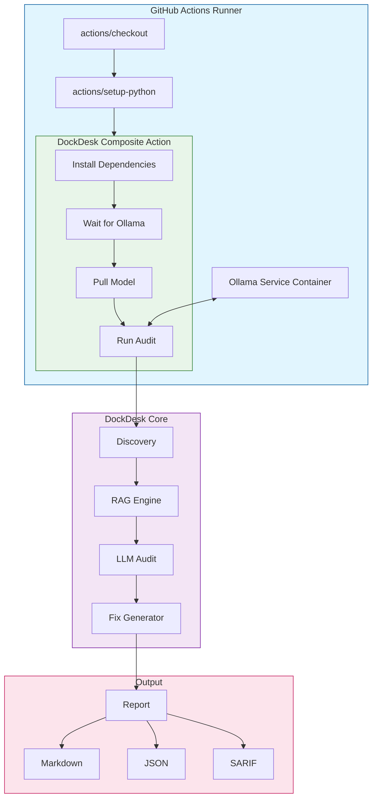

# DockDesk v2.1

**Local-First Semantic Documentation Auditor**

Ensure your code and documentation never drift apart without sending a single byte to the cloud.

[](https://github.com/marketplace/actions/dockdesk-neural-auditor)
[](LICENSE)
[](https://ollama.com)

---

## Table of Contents

- [Overview](#overview)
- [What's New in v2.0](#whats-new-in-v20)
- [Architecture](#architecture)
- [Quick Start](#quick-start)
- [Model Selection](#model-selection)
- [CLI Reference](#cli-reference)
- [GitHub Actions Integration](#github-actions-integration)
- [Dashboard](#dashboard)
- [Configuration](#configuration)
- [Roadmap](#roadmap)
- [Contributing](#contributing)
- [License](#license)

---

## Overview

DockDesk is a semantic auditor that runs entirely on your local machine or CI runner. Instead of checking for typos, it reads your **code logic** and compares it against your **documentation claims**.

If your code uses `os.getenv('API_KEY')` but your README says "Hardcode your key", DockDesk will:

1. Flag the semantic drift
2. Analyze the discrepancy
3. Auto-generate a fix for your documentation

### Problems Solved

| Problem | Solution |
|---------|----------|
| **Privacy Risks** | Runs 100% locally via Ollama. No cloud API calls. |
| **Documentation Rot** | Semantic analysis catches drift that static tools miss. |
| **Infrastructure Cost** | No API credits. Efficient SLMs run on standard hardware. |

---

## What's New in v2.1

| Feature | Description |
|---------|-------------|
| **⚡ Composite Action** | 10x faster GitHub Action - no Docker build (~30s vs ~4min) |
| **Model Freedom** | Choose any Ollama model with LOC-based auto-tuning |
| **One-Click Fixes** | Auto-apply documentation fixes with `--fix` |
| **React Dashboard** | Visualize audit history, trends, and model usage |
| **SARIF Output** | IDE integration for VS Code |
| **Faster Audits** | Git diff scoping, parallel LLM calls, cached RAG |

---

## Architecture



### Component Overview

| Component | File | Description |
|-----------|------|-------------|
| **Action** | `action.yml` | Composite GitHub Action (no Docker) |
| **Auditor** | `auditor_slm.py` | Main CLI entry point |
| **Discovery** | `src/discovery.py` | Scans workspace for code and docs |
| **RAG** | `src/rag.py` | Retrieves context via ChromaDB |
| **Graph** | `src/graph.py` | LangGraph audit pipeline |
| **Fixer** | `src/fixer.py` | Generates and applies fixes |
| **Dashboard** | `dashboard/` | React visualization app |

---

## Quick Start

### Prerequisites

- Python 3.11+
- [Ollama](https://ollama.com) installed and running
- Git (for diff-based auditing)

### Installation

```bash
# 1. Install Ollama
curl -fsSL https://ollama.com/install.sh | sh

# 2. Pull an audit model
ollama pull qwen2.5-coder:3b

# 3. Clone and install DockDesk
git clone https://github.com/srivatsa-source/dockdesk.git
cd dockdesk
pip install -r requirements.txt

# 4. Run your first audit
python auditor_slm.py --workspace /path/to/your/project
```

See [SETUP_GUIDE.md](SETUP_GUIDE.md) for detailed installation instructions.

---

## Model Selection

DockDesk auto-tunes model selection based on codebase size (lines of code):

| Codebase Size | Recommended Model | Speed | Memory |
|---------------|-------------------|-------|--------|
| < 5k LOC | `qwen2.5-coder:1.5b` | Fast | 1GB |
| < 10k LOC | `qwen2.5-coder:3b` | Moderate | 2GB |
| 10-50k LOC | `qwen2.5-coder:7b` | Standard | 4GB |
| > 50k LOC | `qwen2.5-coder:14b` | Thorough | 8GB |

### Supported Models

| Model | Parameters | Best For |
|-------|------------|----------|
| `qwen2.5-coder:1.5b` | 1.5B | Quick scans, small projects |
| `qwen2.5-coder:3b` | 3B | General use, balanced |
| `qwen2.5-coder:7b` | 7B | Medium projects |
| `qwen2.5-coder:14b` | 14B | Large codebases |
| `codellama:7b` | 7B | Alternative, code-focused |
| `codellama:13b` | 13B | Enterprise audits |
| `deepseek-coder:6.7b` | 6.7B | Documentation heavy |
| `deepseek-coder:33b` | 33B | Maximum accuracy |

### Usage

```bash
# Auto-select model based on LOC
python auditor_slm.py --auto-tune

# Specify model manually
python auditor_slm.py --model codellama:7b

# List all supported models
python auditor_slm.py list-models
```

---

## CLI Reference

### Commands

```bash
# Basic audit
python auditor_slm.py --workspace ./my-project

# Auto-tune model and apply fixes
python auditor_slm.py --auto-tune --fix

# CI mode with risk gating
python auditor_slm.py --ci --fail-on-risk HIGH

# SARIF output for VS Code
python auditor_slm.py --format sarif --output audit.sarif

# Export dashboard data
python auditor_slm.py dashboard --export dashboard_data.json

# Initialize configuration file
python auditor_slm.py init
```

### Options

| Option | Short | Description | Default |
|--------|-------|-------------|---------|
| `--workspace` | `-w` | Path to audit | `.` |
| `--model` | `-m` | Ollama model name | `qwen2.5-coder:3b` |
| `--auto-tune` | | Auto-select model by LOC | `false` |
| `--fix` | | Apply documentation fixes | `false` |
| `--fix-code` | | Apply code fixes | `false` |
| `--format` | `-f` | Output format: `md`, `json`, `sarif` | `md` |
| `--output` | `-o` | Output file path | `audit_report.md` |
| `--ci` | | CI mode (non-interactive) | `false` |
| `--fail-on-risk` | | Exit 1 on risk level: `HIGH`, `MEDIUM`, `LOW` | `HIGH` |
| `--skip-rag` | | Skip RAG for faster audits | `false` |
| `--verbose` | `-v` | Verbose output | `false` |

---

## GitHub Actions Integration

> ⚡ **v2.1 uses a Composite Action** - No Docker build means ~30 second execution!

### Basic Setup

```yaml
name: DockDesk Audit
on: [pull_request]

jobs:
  audit:
    runs-on: ubuntu-latest
    
    # Required: Ollama service container
    services:
      ollama:
        image: ollama/ollama:latest
        ports:
          - 11434:11434
    
    steps:
      - uses: actions/checkout@v4
      
      # Pre-pull the model (recommended)
      - name: Pull Model
        run: |
          curl -X POST http://localhost:11434/api/pull \
            -d '{"name": "qwen2.5-coder:3b"}' \
            -H "Content-Type: application/json"
          sleep 15
      
      - name: Run DockDesk
        uses: srivatsa-source/dockdesk@main
        with:
          model: qwen2.5-coder:3b
          fail_on_risk: HIGH
      
      - uses: actions/upload-artifact@v4
        if: always()
        with:
          name: audit-report
          path: audit_report.md
```

### Action Inputs

| Input | Default | Description |
|-------|---------|-------------|
| `model` | `qwen2.5-coder:3b` | Ollama model to use |
| `auto_tune` | `false` | Auto-select model by LOC |
| `fail_on_risk` | `HIGH` | Risk threshold for failure |
| `output_format` | `md` | Output format: `md`, `json`, `sarif` |
| `auto_fix` | `false` | Auto-apply documentation fixes |
| `ollama_host` | `http://localhost:11434` | Ollama server URL |
| `python_version` | `3.11` | Python version to use |

See [.github/workflows/dockdesk-example.yml](.github/workflows/dockdesk-example.yml) for advanced examples.

---

## Dashboard

Visualize audit history with the React dashboard.

### Local Development

```bash
# Export audit data
python auditor_slm.py dashboard --export dashboard/public/dashboard_data.json

# Run dashboard locally
cd dashboard
npm install
npm run dev
```

### Deploy to Vercel

```bash
cd dashboard
npm run build
npx vercel --prod
```

### Dashboard Features

| Feature | Description |
|---------|-------------|
| Audit Timeline | Line chart showing audit frequency over time |
| Risk Distribution | Pie chart of LOW / MEDIUM / HIGH findings |
| Model Usage | Bar chart of model usage statistics |
| Recent Runs | List of recent audits with status indicators |
| Statistics Cards | Total audits, issues found, high-risk count |

---

## Configuration

### Configuration File

Create `dockdesk.yml` in your project root:

```yaml
# Model Selection
model: qwen2.5-coder:3b
auto_tune: false
temperature: 0.1

# Behavior
auto_fix: false
fix_code: false

# Output
output_format: md
fail_on_risk: HIGH

# Dashboard
enable_changelog: true
```

### Environment Variables

| Variable | Description |
|----------|-------------|
| `DOCKDESK_MODEL` | Default model to use |
| `DOCKDESK_AUTO_FIX` | Enable auto-fix (`true`/`false`) |
| `DOCKDESK_FAIL_ON_RISK` | Risk threshold (`HIGH`/`MEDIUM`/`LOW`) |
| `OLLAMA_HOST` | Ollama server URL |

### Priority Order

Configuration values are resolved in this order (highest to lowest priority):

1. CLI arguments
2. Environment variables
3. `dockdesk.yml` file
4. Built-in defaults

---

## Roadmap

### Completed

- [x] Model auto-tuning by LOC
- [x] One-click documentation fixes
- [x] React dashboard
- [x] SARIF output for IDE integration
- [x] **Composite GitHub Action (v2.1)** - 10x faster!

### Planned

- [ ] VS Code extension
- [ ] Pre-commit hook package (npm/pip)
- [ ] Multi-model voting and consensus
- [ ] JavaScript/TypeScript support
- [ ] Publish to GitHub Marketplace under `dockdesk/auditor`

---

## Contributing

Contributions are welcome!

### Development Setup

```bash
git clone https://github.com/srivatsa-source/dockdesk.git
cd dockdesk
python -m venv .venv
source .venv/bin/activate  # or .venv\Scripts\activate on Windows
pip install -r requirements.txt
```

### Project Structure

```
dockdesk/
├── action.yml          # GitHub Composite Action
├── auditor_slm.py      # Main CLI
├── requirements.txt    # Python dependencies
├── src/                # Core modules
│   ├── discovery.py    # File discovery
│   ├── graph.py        # LangGraph pipeline
│   ├── rag.py          # RAG retrieval
│   ├── fixer.py        # Fix generation
│   └── ...
└── dashboard/          # React dashboard
```

---

## License

MIT License - see [LICENSE](LICENSE) for details.

---

**DockDesk** - Industry-grade semantic auditing for high-value repositories.
