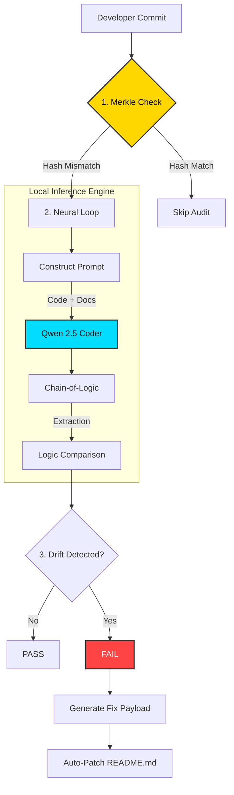

# DockDesk Integrity Agent

> **Local-First Semantic Documentation Auditor**  
> *Ensure your code and documentation never drift apart—without sending a single byte to the cloud.*

[](https://github.com/dockdesk/auditor)
[](LICENSE)
[](https://ollama.com)

---

## What is DockDesk?

DockDesk is a "Neural Auditor" that runs entirely on your local machine or CI runner. Instead of just checking for typos, it reads your **Code Logic** and compares it against your **Documentation Claims**.

If your code uses `os.getenv('API_KEY')` but your README says "Hardcode your key", DockDesk will:
1.  **Flag the Semantic Drift.**
2.  **Understand the Discrepancy.**
3.  **Auto-generate a Fix** for your documentation.

### The Problem It Solves
*   **Privacy Risks**: Most AI auditors require sending your proprietary code to cloud APIs (OpenAI, etc.). DockDesk runs locally.
*   **Documentation Rot**: Developers update code but forget the docs. Static analysis tools can't "read" English instructions.
*   **Infrastructure Cost**: No API credits needed. Runs on efficient "Small Language Models" (SLMs) like `qwen2.5-coder:3b`.

---

## Architecture: The Neural Loop

DockDesk bridges the gap between deterministic CI pipelines and probabilistic AI reasoning using a **Merkle-SLM Hybrid Architecture**.



### Core Components
1.  **Merkle Hash**: Computes SHA-256 of code to skip expensive AI checks if nothing changed.
2.  **Chain-of-Thought Prompting**: Forces the model to "Extract -> Compare -> Judge" for high accuracy.
3.  **Heuristic Parser**: A custom regex recovery system that handles messy SLM outputs, ensuring the pipeline never crashes on invalid JSON.

---

## Getting Started

### Prerequisites
*   **Python 3.11+**
*   **[Ollama](https://ollama.com)** (Must be installed and running)

### Local Installation

1.  **Clone the Repository**
    ```bash
    git clone https://github.com/your-username/dockdesk.git
    cd dockdesk
    ```

2.  **Install Dependencies**
    ```bash
    pip install -r requirements.txt
    ```

3.  **Prepare the Neural Engine**
    Pull the optimized audit model (3B parameters):
    ```bash
    ollama pull qwen2.5-coder:3b
    ```

### Usage

**Interactive Mode (Development)**
Runs the auditor and asks you to apply fixes interactively.
```bash
python auditor_slm.py
```

**CI/CD Mode (Automation)**
Runs silently, generates `audit_report.md`, and exits with generic error codes.
```bash
python auditor_slm.py --ci
```

---

## GitHub Actions Integration

Add this to your `.github/workflows/audit.yml` to audit every Pull Request automatically.

```yaml
name: Neural Documentation Audit
on: [pull_request]

jobs:
  dockdesk-audit:
    runs-on: ubuntu-latest
    steps:
      - uses: actions/checkout@v3
      
      # Use the Dockerized Action
      - name: Run DockDesk Auditor
        uses: ./ 
        with:
          model: 'qwen2.5-coder:3b'
          
      # Post the Report to the PR
      - name: Comment Report
        if: failure()
        uses: tholman/github-action-comment-on-pr@master
        with:
          message_file: "audit_report.md"
          GITHUB_TOKEN: ${{ secrets.GITHUB_TOKEN }}
```

---

## Roadmap v2.0
- [ ] **Vector Hashing**: Use embeddings instead of SHA-256 for semantic change detection.
- [ ] **Dependency Walking**: Automatically find which docs reference the modified code.
- [ ] **Multi-Model Voting**: Use a distinct "Critic" model to validate fixes before applying.

---
*Built by the DockDesk Team*
