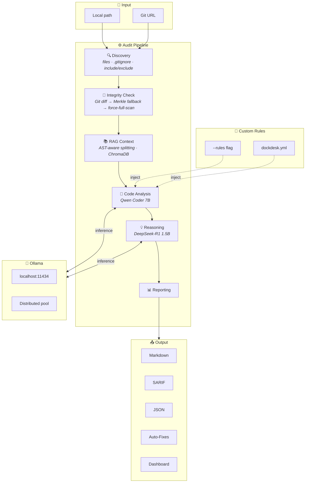

# System Design: The Neural Loop

The "Neural Loop" is the core cognitive architecture of the DockDesk Integrity Agent. It converts unstructured natural language validation into a deterministic pipeline suitable for CI/CD environments.

## Architecture

### 1. Discovery & Integrity (Steps 1-2)
**Objective:** Deterministic Change Detection.
- Discovery scans the workspace for code files and documentation, respecting `.gitignore` and include/exclude globs.
- Integrity uses a 3-tier strategy: **Git diff** (preferred) → **Merkle tree** (fallback) → **Force full scan** (flag).
- Git diff intersects changed files with discovered files to filter artifacts.
- Untracked files are included via `git ls-files --others --exclude-standard`.
- **Fail-Fast:** If the Merkle hash matches the previous snapshot, the audit is skipped.

### 2. RAG Context (Step 3)
**Objective:** Contextual Loading via AST-Aware Splitting.
- Documentation and code are ingested into a ChromaDB vector store.
- **AST-aware splitters** for 20+ languages (Python, JS, Java, Go, Rust, etc.) preserve semantic boundaries.
- Falls back to recursive character splitting for unsupported file types.
- Skippable via `--skip-rag` for faster audits.

### 3. Code Analysis (Step 4)
**Objective:** Semantic Drift Detection.
- **Code Agent:** Qwen Coder 7B analyzes each file against its documentation.
- **Custom Rules:** User-defined rules from `--rules` flag or `dockdesk.yml` are injected into the system prompt.
- Supports individual and batched analysis modes.
- Results are cached in SQLite for incremental re-runs.
- **Strict Mode:** Temperature is set to `0.1` to reduce creative hallucination.

### 4. Reasoning (Step 5)
**Objective:** Risk Assessment & Push Safety.
- **Reasoning Agent:** DeepSeek-R1 1.5B reviews code analysis results and assigns risk levels (HIGH/MEDIUM/LOW).
- PASS files are skipped (no reasoning needed).
- Fast mode (`--fast`) skips reasoning for low-signal files.
- Determines `safe_to_push` verdict for each file.

### 5. Reporting (Step 6)
**Objective:** Human-in-the-Loop Feedback.
- **Formats:** Markdown, JSON, SARIF (for IDE/Code Scanning integration).
- **CI Mode:** Exits with code 1 on risk threshold breach.
- **Auto-Fix:** Optional `--fix` flag applies documentation corrections.
- **Dashboard:** Auto-exports `dashboard_data.json` for the React dashboard.
- **Changelog:** Appends to `audit_history.jsonl` for trend tracking.
